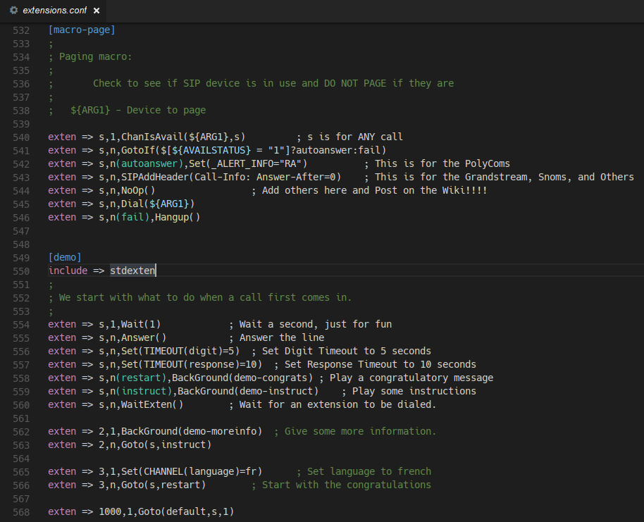

# Asterisk® config files syntax highlighting extension

This Extension for Visual Studio Code provides syntax highlighting for [Asterisk®](http://www.asterisk.org) configuration files.
This is derived work based on [Sublime Asterisk Config](https://github.com/vladimir-kotikov/SublimeAsteriskConfig) by Vladimir Kotikov.

Source code hosting for this extension can be found at:

* https://github.com/ffloimair/vscode-asterisk-syntax

## Features

Syntax highlighting support for Asterisk configuration files for:

  * comments
  * sections
  * keywords
  * variables
  * dialplan labels

## Release notes

### 1.0.0 (2017-11-20)

  * Initial version.
  * Based on SublimeAsteriskConfig language file by Vladimir Kotikov.